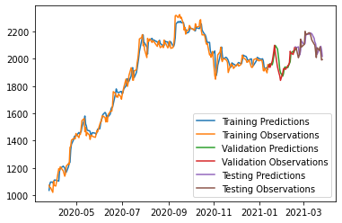

# Stock-Market-Prediction-using-LSTM-model
Deep learning, PyTorch, Python

Developed an algorithm to predict a stock price using an LSTM model by taking multiple sets of market and technical indicators as features. Data was loaded from yahoof using an API for real time data collection. Visualized the results using matplotlib and optimized the model by minimizing the MSE.

 
 
